## 10章
## 中規模・大規模向けのアプリケーション開発③
## 実装

--

### *注意事項*

- *このリポジトリは[[秋葉原] Vue.js入門 輪読会 9章 10章 中規模・大規模向けアプリケーション開発(最終回)](https://weeyble-js.connpass.com/event/138337/)の発表資料として用意したリポジトリです。*
- *書籍の要約は正体、担当者の理解で書いているところは斜体で記載しています*
- *権利関係で問題があればご指摘ください*
- *vscode-revealで見てもらうことを想定しています(Windowsは改行コードをLFにして見てください)*
- *コードは書いておらず、サンプルコードを動かしながら資料作ったので、コードの詳細は理解できていないです*

--

### 自己紹介

- 安ヶ平雄太（yasugahira0810）と申します
- SIerのアジャイル推進部隊でスクラムマスターしてます  
  その前はインフラエンジニアだったので真面目にJSやVue.js使ってないです
- 去年の輪読会で作った資料たち
  + [猫本 3章 双方向データバインティング](https://github.com/yasugahira0810/vuejs_chapter3)
  + [猫本 8章 Vuex](https://github.com/yasugahira0810/vuejs_chapter8)
  + [Vue.js入門 2章 Vue.jsの基本](https://github.com/yasugahira0810/Vue.js_chapter2)
  + [Vue.js入門 4章 Vue Router](https://github.com/yasugahira0810/Vue.js_chapter4)

--

### メモ

- :class="classes" データバインディングをするv-bindの省略記法
- @click="handleClick" イベントハンドリングをするv-onの省略記法
- アプリのアカウント: foo@domain.com　/　12345678
- propsData[参考]([https://lmiller1990.github.io/vue-testing-handbook/ja/components-with-props.html#propsdata%E3%81%AE%E5%9F%BA%E6%9C%AC%E7%9A%84%E3%81%AA%E4%BD%BF%E3%81%84%E6%96%B9](https://lmiller1990.github.io/vue-testing-handbook/ja/components-with-props.html#propsdataの基本的な使い方))
  + `propsData` は親コンポーネントから `props` として渡されたものとしてテストで使用できる

---

## 10章概要

- 大きく２つに分かれる
  + 10.2〜10.4 ログインページの実装
  + 10.5〜10.9 Vue.js開発を支える技術
- ボードページ、タスク詳細ページの実装の解説はしない（書籍自体に解説が載っていないので）

---

## 10.1 開発方針の整理

- **ログインページ**
  - **ログインページのコンポーネント**
  - **ログインページのデータフロー**
  - **全体のルーティング**
- ボードページ
- タスク詳細ページ

**加えて開発に必要な技術**

---

## 10.2 コンポーネントの実装

--

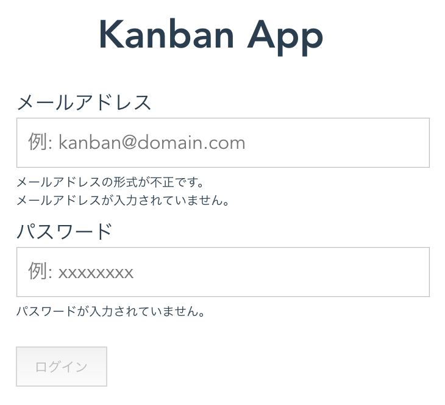

- ボトムアップ的なアプローチを推奨

--

### 10.2.1 KbnButtonコンポーネント

- API設計は「9.2.3 KbnButtonコンポーネントのAPI」参照
- 書籍ではテスト駆動開発のスタイルで開発を進めている
- 9.2.3の設計項目に対してテストしている

--

[コード（GitHubへ飛ぶ）](https://github.com/yasugahira0810/Vue.js_chapter10/blob/master/kanban-app/src/components/atoms/C)

--

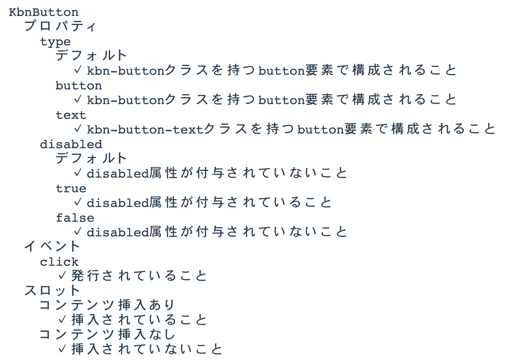

--

### 10.2.2 KbnLoginFormコンポーネント

- ログインフォーム
- 入力情報をバリデーションする役割を持つ
- 認証処理はAuth APIモジュールに任せている

--

[コード（GitHubへ飛ぶ）](https://github.com/yasugahira0810/Vue.js_chapter10/blob/master/kanban-app/src/components/molecules/KbnLoginForm.vue)

--

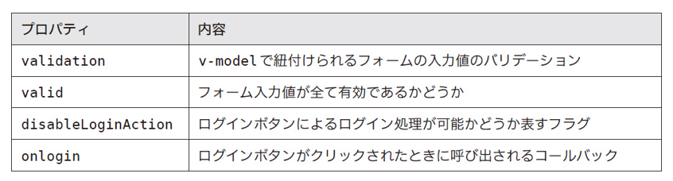

- validation, valid, disableLoginActionプロパティは算出プロパティ
- onloginプロパティは外部コンポーネントに処理を任せているので、コールバック時のログインOK/NGのみテスト

--

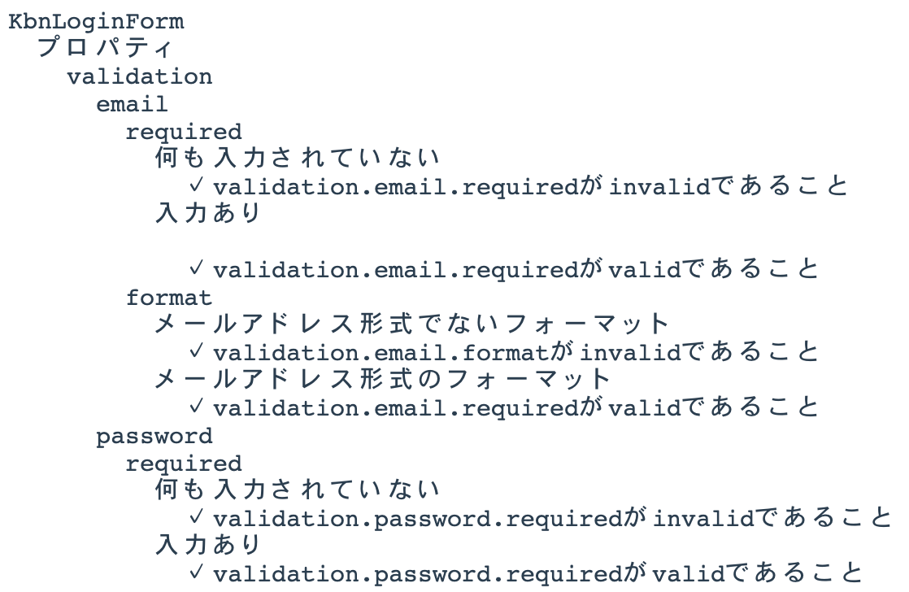

--

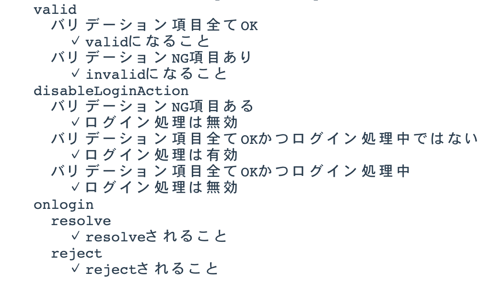

--

### 10.2.3 KbnLoginViewコンポーネント

- データフロー設計は「9.3.2 データフロー」参照
- ルーティング設計は「9.4 ルーティング設計」参照
- ログイン処理について検証
- KbnLoginFormコンポーネントのスタブを利用

--

[コード（GitHubへ飛ぶ）](https://github.com/yasugahira0810/Vue.js_chapter10/blob/master/kanban-app/src/components/templates/KbnLoginView.vue)

--

---

## 10.3 データフローの実装

--

### 10.3.1 loginアクションハンドラ

[コード（GitHubへ飛ぶ）](https://github.com/yasugahira0810/Vue.js_chapter10/blob/master/kanban-app/src/store/actions.js)

--

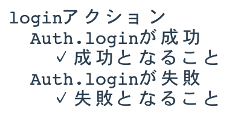

--

### 10.3.2 AUTH_LOGINミューテーションハンドラ

[コード（GitHubへ飛ぶ）](https://github.com/yasugahira0810/Vue.js_chapter10/blob/master/kanban-app/src/store/mutations.js)

--

--

### 10.3.3 AuthAPIモジュール

[コード（GitHubへ飛ぶ）](https://github.com/yasugahira0810/Vue.js_chapter10/blob/master/kanban-app/src/api/auth.js)

--

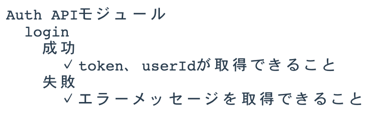

---

### 10.4 ルーティングの実装

--

### 10.4.1 beforeEachガードフックを活用したナビゲーションガード

[コード（GitHubへ飛ぶ）](https://github.com/yasugahira0810/Vue.js_chapter10/blob/master/kanban-app/src/router/guards.js)

--

---

## 10.5
## 開発サーバーとデバッグ

- 10.5.1 開発サーバーによる開発
  + タスクコマンドnpm run devを解説
- 10.5.2 Vue DevToolsによるデバッグ
  + 開発効率化拡張機能を解説

--

### 10.5.1 開発サーバーによる開発

- バックエンドのAPIサーバーを作成していないので、ログインボタンをクリックしても404になる
- 対処法は以下の２つ。今回は後者を採用
  1. APIのプロキシ機能を利用してバックエンドとインテグレートする
  2. ローカル環境の開発サーバーに該当エンドポイントのモックを実装する

--

[コード（GitHubへ飛ぶ）](https://github.com/yasugahira0810/Vue.js_chapter10/blob/master/kanban-app/build/dev-server.js)

- 以下のレスポンスを返す簡易的な実装
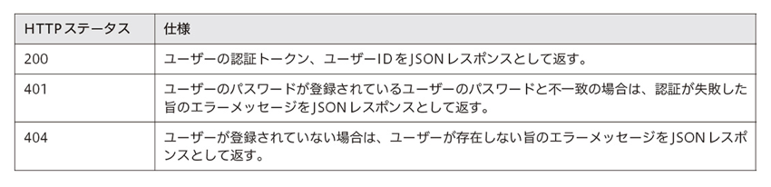

--

- Vue UIのstartを実行すると「npm run dev」が実行されるので、これでいい感ある

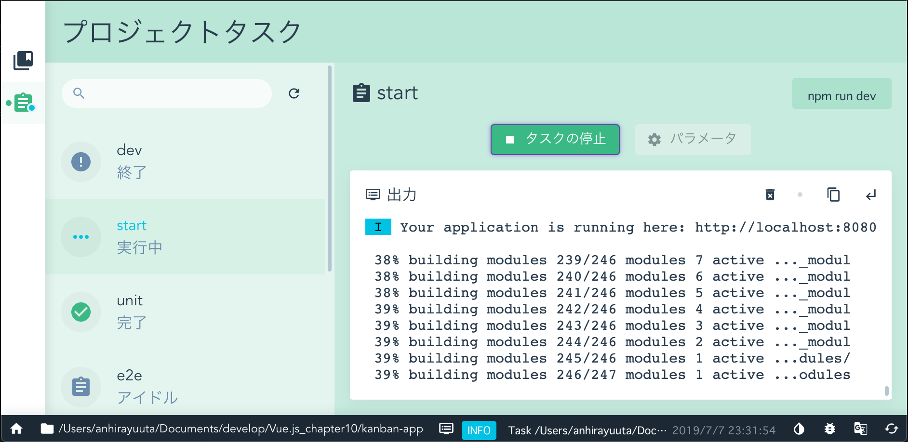

--

### 10.5.2 Vue DevToolsによるデバッグ

- Chromeに拡張機能「Vue DevTools」を追加する
- Vue.jsが検知されるとアイコンが有効になる
- ディベロッパーツールに「Vue」タブが追加される

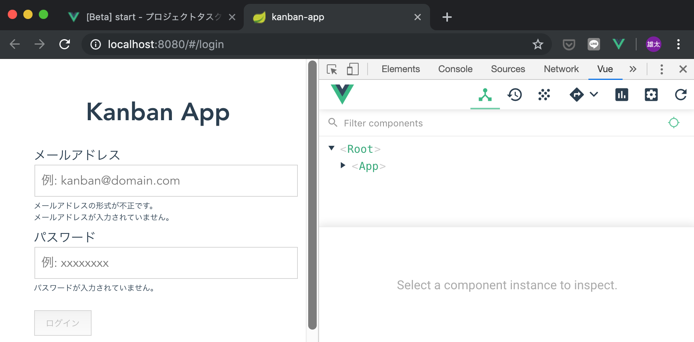

--

- 書籍でピックアップされている機能

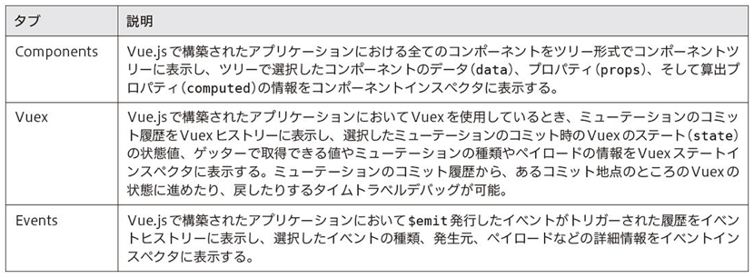

---

## 10.6 E2Eテスト

--

- 単体テストだけでは実際の動作を確認できない
- 手動テストは作業量が膨大で大変
- E2Eテストフレームワークによる自動化が一般的
  + ここではNightWatchを使う

--

[テストコード（GitHubへ飛ぶ）](https://github.com/yasugahira0810/Vue.js_chapter10/blob/master/kanban-app/test/e2e/specs/login.js)

--

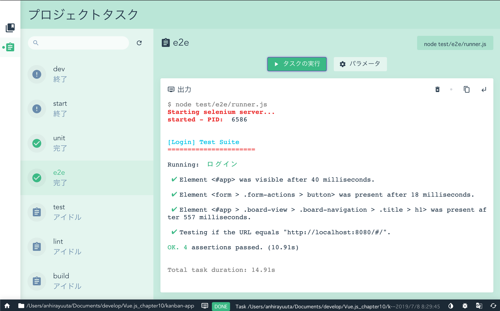

---

## 10.7 アプリケーションのエラーハンドリング

--

- 単体テストやE2Eテストを見てきたが、想定できないエラーが発生する可能性はある
- Vue.jsのようなインタラクティブなUIを実装したアプリではエラーハンドリングは特に重要
- エラーを捕捉して適切にエラーハンドリングしないと、UIが壊れる可能性がある
- Vue.jsが提供するエラーハンドリングの仕組み
  + 子コンポーネントのエラーハンドリング
  + グローバルなエラーハンドリング

--

### 10.7.1 子コンポーネントのエラーハンドリング

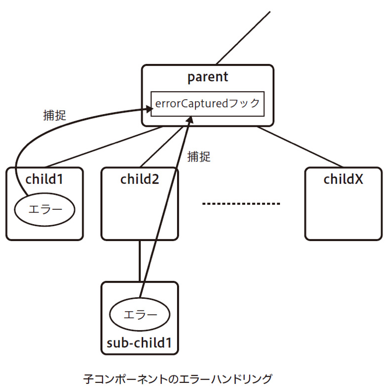

--

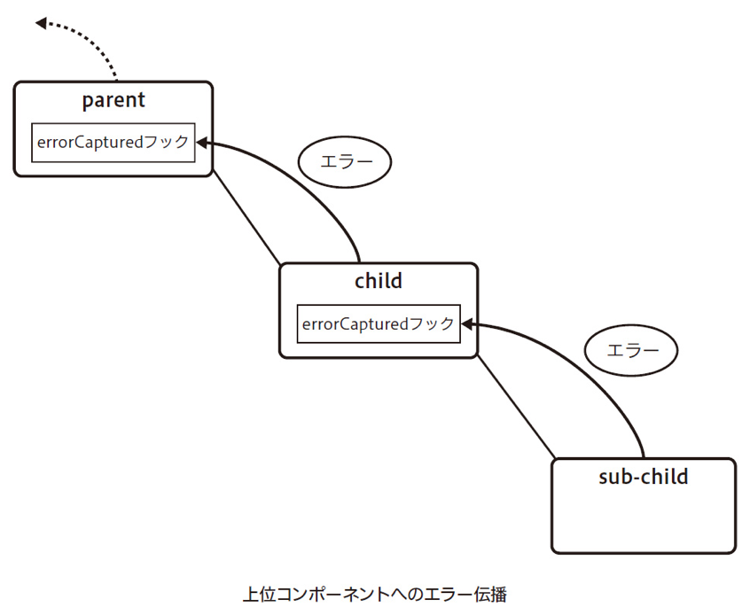

--

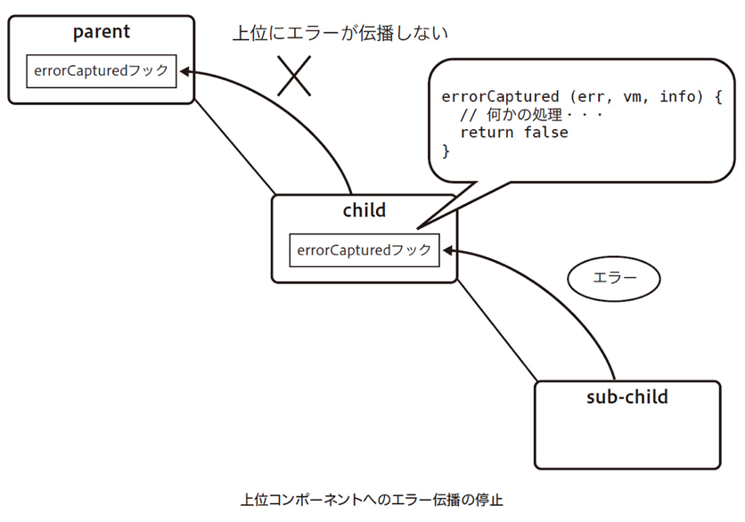

--

[コード（GitHubへ飛ぶ）](https://github.com/yasugahira0810/Vue.js_chapter10/blob/master/kanban-app/src/ErrorBoundary.vue)

--

### 10.7.2 グローバルなエラーハンドリング

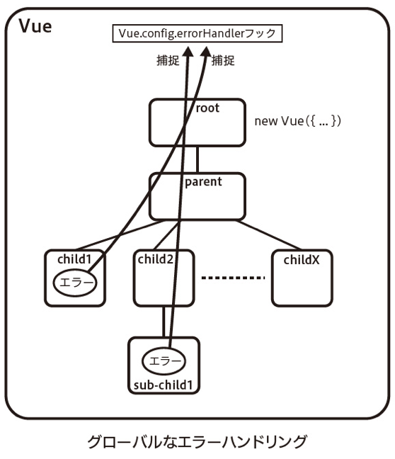

--

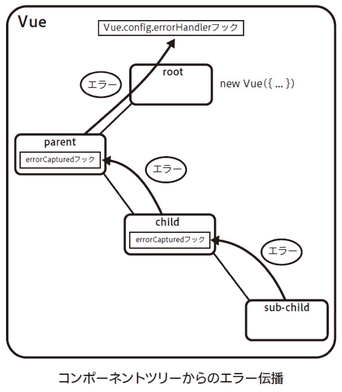

--

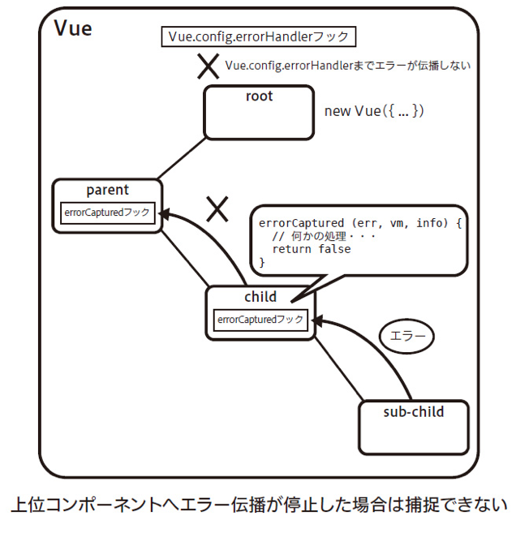

--

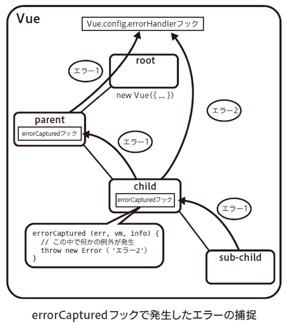

--

[コード（GitHubへ飛ぶ）](https://github.com/yasugahira0810/Vue.js_chapter10/blob/master/kanban-app/src/main.js)

---

## 10.8 ビルドとデプロイ

--

### 10.8.1 アプリケーションのビルド

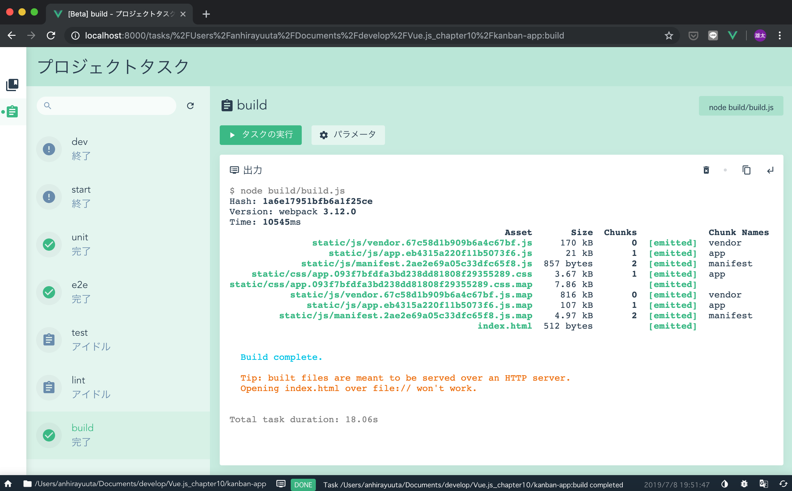

--

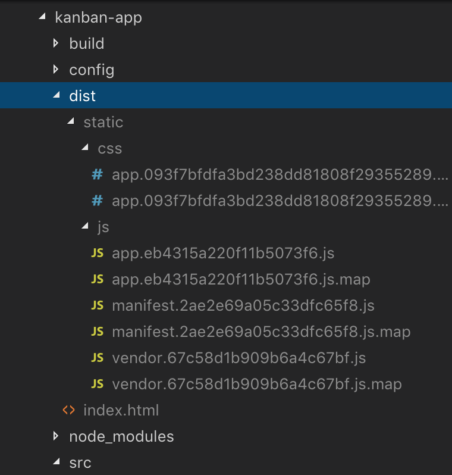

--

### 10.8.2 アプリケーションのデプロイ

- ビルドされたアセットファイル群一式をHTTPサーバのドキュメントルートにデプロイすればよい
- バックエンドのAPIは必要

---

## 10.9 パフォーマンス測定・改善

- よりよいユーザ体験のためにパフォーマンス改善が必要
- Webアプリ一般では、サーバレスポンスの向上などが大切
- Vue.jsアプリでは、JavaScriptによるレンダリングの高速化が重要

--

### 10.9.1 パフォーマンス測定の設定方法

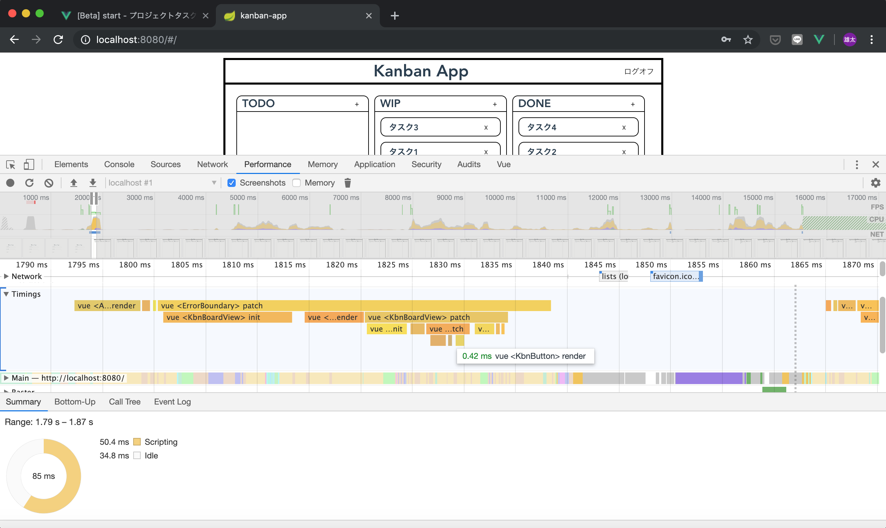

--

### 10.9.2 測定できる処理

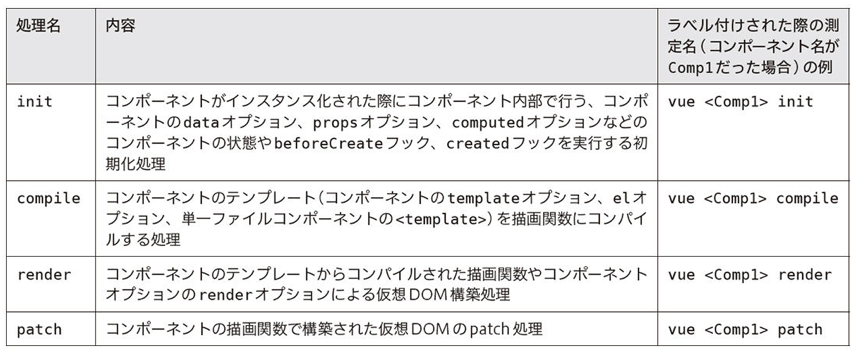

- renderは改善の余地が生まれやすい

--

### 10.9.3 レンダリングパフォーマンスの向上

--

1. v-ifとv-showを使い分ける（*既出*）
2. データバインドはメソッドより算出プロパティを利用する（*既出*）
3. 算出プロパティとウォッチャを使い分ける
4. v-forによるリストのレンダリングではなるべくkey属性を利用する
5. v-onceでコンポーネントのコンテンツをキャッシュする
6. 関数型コンポーネントを利用する
7. テンプレートを事前コンパイルする
8. テンプレートコンパイラのオプションを利用する（応用）

--

**3. 算出プロパティとウォッチャを使い分ける**

- 常に算出プロパティがベストというわけではない
- 算出プロパティのキャッシュが効かない場合はウォッチャを利用する
  + ループなどの処理コストが高い処理
  + 非同期を伴う処理

--

**4. v-forによるリストのレンダリングではなるべくkey属性を利用する**

- v-forではkey属性を利用してレンダリングすべき
  + 多くのケースでレンダリング性能を向上できる
  + リストの内容が頻繁かつ大幅に変わるケースでは性能向上は期待できないので、v-forを使わずリスト内容をレンダリングする

--

**5. v-onceでコンポーネントのコンテンツをキャッシュする**

- Vue.jsのコンパイラは静的なコンテンツをキャッシュする。これにより仮想DOMのdiffがスキップされて実行コストが減る。
- レンダリングされるコンテンツを初回だけ評価するv-onceを利用することで、動的なコンテンツについてもキャッシュを使える。

--

**6. 関数型コンポーネントを利用する**

- Vue.jsのコンポーネントの一種。インスタンス化せず描画関数（render）を実行するので、インスタンス化のオーバヘッドがなくなる。
- コンポーネント内部に状態を保持せずプロパティのみでコンポーネントをレンダリングするケースでは性能向上が期待できる。
- 関数型コンポーネントの作り方
  + コンポーネントオプションにfunctional: trueを設定
  + renderオプションを適切に実装

--

**7. テンプレートを事前コンパイルする**

- テンプレートを事前コンパイルすることで、実行時のコンパイルコストを減らす
- Vue Loaderなどを使っていれば、ビルド時に描画関数にコンパイルしてくれている
- なので特に気にしなくても事前コンパイルはされているはず

--

**8. テンプレートコンパイラのオプションを利用する（応用）**

- Vue.jsのテンプレートコンパイラのAPIを介して、レンダリングを最適化できる**余地があるかもしれない**
- コンパイラ、ランタイムについての理解が必要なので初心者向きではない
- 本来はアプリ向けではなく、プラグインやUIライブラリ開発向けに提供されるもの
- 利用したい場合は書籍に記載の参考情報を確認すること