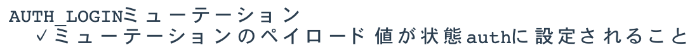

## 10章
## 中規模・大規模向けのアプリケーション開発③
## 実装

--

### *注意事項*

- *このリポジトリは[[秋葉原] Vue.js入門 輪読会 9章 10章 中規模・大規模向けアプリケーション開発(最終回)](https://weeyble-js.connpass.com/event/138337/)の発表資料として用意したリポジトリです。*
- *書籍の要約は正体、担当者の理解で書いているところは斜体で記載しています*
- *権利関係で問題があればご指摘ください*
- *vscode-revealで見てもらうことを想定しています(Windowsは改行コードをLFにして見てください)*
- *コードは書いておらず、サンプルコードを動かしながら資料作ったので、コードの詳細までは理解できていないです...*

--

### 自己紹介

- 安ヶ平雄太（yasugahira0810）と申します
- SIerのアジャイル推進部隊でスクラムマスターしてます  
  その前はインフラエンジニアだったので真面目にJSやVue.js使ってないです
- これまでの輪読会で作った資料たち
  + [猫本 3章 双方向データバインティング](https://github.com/yasugahira0810/vuejs_chapter3)
  + [猫本 8章 Vuex](https://github.com/yasugahira0810/vuejs_chapter8)
  + [Vue.js入門 2章 Vue.jsの基本](https://github.com/yasugahira0810/Vue.js_chapter2)
  + [Vue.js入門 4章 Vue Router](https://github.com/yasugahira0810/Vue.js_chapter4)

--

### メモ

- :class="classes" データバインディングをするv-bindの省略記法
- @click="handleClick" イベントハンドリングをするv-onの省略記法
- ログイン情報: foo@domain.com/12345678
- propsDataは親コンポーネントからpropsとして渡されたものとしてテストで使用できる[[参考](https://lmiller1990.github.io/vue-testing-handbook/ja/components-with-props.html#propsdata%E3%81%AE%E5%9F%BA%E6%9C%AC%E7%9A%84%E3%81%AA%E4%BD%BF%E3%81%84%E6%96%B9)]

--

## 10章のスコープ（概要）

- 大きく２つに分かれる
  + 10.2〜10.4 ログインページの実装
  + 10.5〜10.9 Vue.js開発を支える技術
- ボードページ、タスク詳細ページの実装の解説はしない（書籍自体に解説が載っていないので）

---

## 10.1
## 開発方針の整理

--

- テスト駆動開発のスタイルで解説する

---

## 10.2
## コンポーネントの実装

--

- 実装順序はボトムアップ的なアプローチを推奨
  + 10.2.1 KbnButton  
  + 10.2.2 KbnLoginForm  
  + 10.2.3 KbnLoginView

--

### 10.2.1 KbnButtonコンポーネント

- API設計は「9.2.3 KbnButtonコンポーネントのAPI」参照
- 9.2.3の設計項目に対してテストしている
- [Mocha](https://mochajs.org/)というJSテストフレームワークを利用
- 振る舞い駆動開発(BDD)でテストコードを書く

--

**試験項目**

--

**KbnButtonの例１**

--

**KbnButtonの例２**

--

**KbnButton.vue**

[コード（GitHubへ飛ぶ）](https://github.com/yasugahira0810/Vue.js_chapter10/blob/master/kanban-app/src/components/atoms/KbnButton.vue)

- :class="classes: データバインディングをするv-bindの省略記法"(2.9.2)
- @click="handleClick": イベントハンドリングをするv-onの省略記法(2.9.4)
- slot: 親のコンポーネントごとに子のコンポーネントの内容を書きかえる仕組み(3.4.3)

--

### 10.2.2 KbnLoginFormコンポーネント

- ログインフォーム
- 入力情報をバリデーションする役割を持つ
- 認証処理はAuth APIモジュールが担う(10.3.3参照)

--

**試験項目1/2**

--

**試験項目2/2**

--

**試験対象プロパティ**

- validation, valid, disableLoginActionプロパティは算出プロパティ
- onloginプロパティは外部コンポーネントに処理を任せているので、コールバック時のログインOK/NGのみテスト

--

**KbnLoginForm.vue**

[コード（GitHubへ飛ぶ）](https://github.com/yasugahira0810/Vue.js_chapter10/blob/master/kanban-app/src/components/molecules/KbnLoginForm.vue)

--

### 10.2.3 KbnLoginViewコンポーネント

- KbnLoginFormコンポーネントのログイン処理を契機に、入力情報をサーバに送って認証する
  + 認証後に成功すると、メインページであるボードページに遷移する
- 単体テストはKbnLoginFormコンポーネントのスタブを利用して、ログイン処理を検証する
  + スタブ: テストに用いるテスト対象外の代用品
  + スタブを使うのは、KbnLoginFormの内部の状態に左右されないようにするため

--

**試験項目**

--

**KbnLoginView.vue**

[コード（GitHubへ飛ぶ）](https://github.com/yasugahira0810/Vue.js_chapter10/blob/master/kanban-app/src/components/templates/KbnLoginView.vue)

---

## 10.3
## データフローの実装

--

### 10.3.1 loginアクションハンドラ

- データフロー設計は「9.3.2 データフロー」参照

--

**試験項目**

--

**試験イメージ**

[テストコード（GitHubへ飛ぶ）](https://github.com/yasugahira0810/Vue.js_chapter10/blob/master/kanban-app/test/unit/specs/store/actions/login.spec.js)

--

**loginアクションハンドラの実装**

[コード（GitHubへ飛ぶ）](https://github.com/yasugahira0810/Vue.js_chapter10/blob/master/kanban-app/src/store/actions.js)

--

### 10.3.2 AUTH_LOGINミューテーションハンドラ

--

**試験項目**

--

**試験イメージ**

[テストコード（GitHubへ飛ぶ）](https://github.com/yasugahira0810/Vue.js_chapter10/blob/master/kanban-app/test/unit/specs/store/mutations/auth_login.spec.js)

--

**AUTH_LOGINミューテーションハンドラの実装**

[コード（GitHubへ飛ぶ）](https://github.com/yasugahira0810/Vue.js_chapter10/blob/master/kanban-app/src/store/mutations.js#L3-L6)

--

### 10.3.3 AuthAPIモジュール

- 前節まででデータフローは概ね実装した
- loginアクションハンドラ内で呼び出すAuth APIモジュールが未実装なので実装する

--

**試験項目**

[テストコード（GitHubへ飛ぶ）](https://github.com/yasugahira0810/Vue.js_chapter10/blob/master/kanban-app/test/unit/specs/api/auth.spec.js)

- バックエンドを模倣したサーバを動作させず、JavaScriptのコードレベルでAPIの仕様に沿った通信結果を返すモックを実装

--

**Auth APIモジュール**

[コード（GitHubへ飛ぶ）](https://github.com/yasugahira0810/Vue.js_chapter10/blob/master/kanban-app/src/api/auth.js#L4-L12)

---

## 10.4
## ルーティングの実装

--

### 10.4.1 beforeEachガードフックを活用したナビゲーションガード

- ルーティング設計は「9.4 ルーティング設計」参照
- Vue RouterのbeforeEachガードフックを活用して、ログイン済みチェックをするナビゲーションガードを実装する

--

**試験項目**

[テストコード（GitHubへ飛ぶ）](https://github.com/yasugahira0810/Vue.js_chapter10/blob/master/kanban-app/test/unit/specs/router/guards.spec.js)
- テストコード内でVue Routerによるルート定義やVuexで状態設定をして、ローカルなVue環境を作成している

--

**beforeEachガードフックの実装**

[コード（GitHubへ飛ぶ）](https://github.com/yasugahira0810/Vue.js_chapter10/blob/master/kanban-app/src/router/guards.js)

---

## 10.5
## 開発サーバーとデバッグ

--

- 書籍ではここまでテストコードを書いてテスト駆動開発をしてきた。ボトムアップ的にアプリ開発できる点が強み
- ただこのアプローチだとUIやレイアウトなどの見た目や振る舞いを確認できない
- 結局のところサーバとブラウザを使った確認は必須。本節ではnpm run devで開発サーバを起動する
- 併せてVue DevToolsを使ったデバッグや性能チェックについて紹介

--

### 10.5.1 開発サーバーによる開発

- バックエンドのAPIサーバーを作成していないので、ログインボタンをクリックしても404になる
- 対処法は以下の２つ。今回は後者を採用
  1. APIのプロキシ機能を利用してバックエンドとインテグレートする
  2. ローカル環境の開発サーバーに該当エンドポイントのモックを実装する

--

**エンドポイント/auth/loginのモック**

[コード（GitHubへ飛ぶ）](https://github.com/yasugahira0810/Vue.js_chapter10/blob/master/kanban-app/build/dev-server.js#L56-L69)

- 以下のレスポンスを返す簡易的な実装

--

**開発サーバ起動**

- Vue UIのstartを実行すると「npm run dev」が実行されるので、これでいい感ある

--

### 10.5.2 Vue DevToolsによるデバッグ

- Chromeに拡張機能「Vue DevTools」を追加する
- Vue.jsが検知されるとアイコンが有効になる
- ディベロッパーツールに「Vue」タブが追加される

--

- 書籍でピックアップされている機能

---

## 10.6
## E2Eテスト

--

- 単体テストだけでは実際の動作を確認できない
- 手動テストは作業量が膨大で大変
- E2Eテストフレームワークによる自動化が一般的
  + ここではNightWatchを使う

--

### 10.6.1 E2Eテストの実装

[テストコード（GitHubへ飛ぶ）](https://github.com/yasugahira0810/Vue.js_chapter10/blob/master/kanban-app/test/e2e/specs/login.js)
- 確認項目はログイン後、ボードページにリダイレクトすること

--

### 10.6.2 テストの実行

- 3件のwaitForXXXが試験項目としてカウントされているが、確認項目は先述の１件

---

## 10.7
## アプリケーションのエラーハンドリング

--

- 単体テストやE2Eテストを見てきたが、想定できないエラーが発生する可能性はある
- Vue.jsのようなインタラクティブなUIを実装したアプリではエラーハンドリングは特に重要
- エラーを捕捉して適切にエラーハンドリングしないと、UIが壊れる可能性がある
- Vue.jsが提供するエラーハンドリングの仕組み
  + 子コンポーネントのエラーハンドリング
  + グローバルなエラーハンドリング

--

### 10.7.1 子コンポーネントのエラーハンドリング

--

- Vueは任意の子コンポーネントのエラーハンドリングのためにコンポーネントのライフサイクルAPIとしてerrorCapturedフックを提供する

--

- 親コンポーネントもerrorCapturedフックを実装していると、子のエラーが親にも伝播する

--

- errorCapturedフックでfalseを返すと、上位コンポーネントへは伝播しない
- 子コンポーネントツリーのエラーを回復できる場合はfalseを返してよい
- でなければユーザ向けにメッセージ出力すべき

--

**子コンポーネントエラーハンドリングの実装**

[コード（GitHubへ飛ぶ）](https://github.com/yasugahira0810/Vue.js_chapter10/blob/master/kanban-app/src/ErrorBoundary.vue)

- ユーティリティ的なコンポーネントとして実装して使いまわすデザインパターンが推奨

--

### 10.7.2 グローバルなエラーハンドリング

--

- Vue.jsはコンポーネントに閉じないグローバルなエラーハンドリングも提供している
- Vue.config.errorHandlerフックを用いる

--

- Vue.config.errorHandlerフックはerrorCapturedフックと同じインタフェースでエラーを捕捉する
- Vue.config.errorHandlerフックとerrorCapturedフックは併用可能

--

- errorCapturedフックでfalseを返す場合はエラー伝播が止まるので、Vue.config.errorHandlerフックはエラーを捕捉できない

--

- errorCapturedフック自身が発生させたエラーはVue.config.errorHandlerフックが捕捉する

--

**グローバルなエラーハンドリングの実装**

[コード（GitHubへ飛ぶ）](https://github.com/yasugahira0810/Vue.js_chapter10/blob/master/kanban-app/src/main.js#L14-L18)

---

## 10.8
## ビルドとデプロイ

--

### 10.8.1 アプリケーションのビルド

- *ビルド結果。コンソールでnpm run buildするとnode build/build.jsが実行されるっぽいので、やっていることは同じっぽい*

--

**ビルドされたアセットファイル群**

--

### 10.8.2 アプリケーションのデプロイ

- ビルドされたアセットファイル群一式をHTTPサーバのドキュメントルートにデプロイすればよい
- バックエンドのAPIは必要

---

## 10.9
## パフォーマンス測定・改善

--

- よりよいユーザ体験のために性能改善が欠かせない
- Webアプリ一般では、サーバレスポンスの向上などが大切
- Vue.jsアプリでは、JavaScriptによるレンダリングの高速化が重要

--

### 10.9.1 パフォーマンス測定の設定方法

- Vue.jsはブラウザの開発者ツールで性能測定が可能
- src/main.jsでVue.config.performance=trueを設定

--

**性能測定のイメージ**

--

### 10.9.2 測定できる処理

- renderは改善の余地が生まれやすい

--

### 10.9.3 レンダリングパフォーマンスの向上

--

1. v-ifとv-showを使い分ける（*既出*）
2. データバインドはメソッドより算出プロパティを利用する（*既出*）
3. 算出プロパティとウォッチャを使い分ける
4. v-forによるリストのレンダリングではなるべくkey属性を利用する
5. v-onceでコンポーネントのコンテンツをキャッシュする
6. 関数型コンポーネントを利用する
7. テンプレートを事前コンパイルする
8. テンプレートコンパイラのオプションを利用する（応用）

--

**3. 算出プロパティとウォッチャを使い分ける**

- 算出プロパティとメソッドなら基本前者を使うべき
- 常に算出プロパティがベストというわけではない
- 算出プロパティのキャッシュが効かない場合はウォッチャを利用する
  + ループなどの処理コストが高い処理
  + 非同期を伴う処理
- 参考：[ウォッチャ](https://jp.vuejs.org/v2/guide/computed.html#%E3%82%A6%E3%82%A9%E3%83%83%E3%83%81%E3%83%A3)

--

**4. v-forによるリストのレンダリングではなるべくkey属性を利用する**

- v-forではkey属性を利用してレンダリングすべき
  + 多くのケースでレンダリング性能を向上できる
  + リストの内容が頻繁かつ大幅に変わるケースでは性能向上は期待できないので、v-forを使わずリスト内容をレンダリングする

--

**5. v-onceでコンポーネントのコンテンツをキャッシュする**

- Vue.jsのコンパイラは静的なコンテンツをキャッシュする。これにより仮想DOMのdiffがスキップされて実行コストが減る。
- レンダリングされるコンテンツを初回だけ評価するv-onceを利用することで、動的なコンテンツについてもキャッシュを使える。
- 参考：[v-onceを使用するチープスタティックコンポーネント](https://jp.vuejs.org/v2/guide/components-edge-cases.html#v-once-%E3%82%92%E4%BD%BF%E7%94%A8%E3%81%99%E3%82%8B%E3%83%81%E3%83%BC%E3%83%97%E3%82%B9%E3%82%BF%E3%83%86%E3%82%A3%E3%83%83%E3%82%AF%E3%82%B3%E3%83%B3%E3%83%9D%E3%83%BC%E3%83%8D%E3%83%B3%E3%83%88)

--

**6. 関数型コンポーネントを利用する**

- Vue.jsのコンポーネントの一種。インスタンス化せず描画関数（render）を実行するので、インスタンス化のオーバヘッドがなくなる。
- コンポーネント内部に状態を保持せずプロパティのみでコンポーネントをレンダリングするケースでは性能向上が期待できる。
- 関数型コンポーネントの作り方
  + コンポーネントオプションにfunctional: trueを設定
  + renderオプションを適切に実装

--

**7. テンプレートを事前コンパイルする**

- テンプレートを事前コンパイルすることで、実行時のコンパイルコストを減らす
- Vue Loaderなどを使っている場合、ビルド時に描画関数にコンパイルしてくれている
- なので特に気にしなくても事前コンパイルはされているはず

--

**8. テンプレートコンパイラのオプションを利用する（応用）**

- Vue.jsのテンプレートコンパイラのAPIを介して、レンダリングを最適化できる**余地があるかもしれない**
- コンパイラ、ランタイムについての理解が必要なので**初心者向きではない**
- 本来はアプリ向けではなく、プラグインやUIライブラリ開発向けに提供されるもの
- 利用したい場合は書籍に記載の参考情報を確認すること