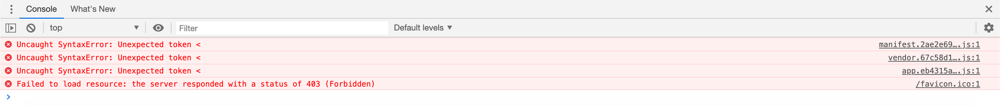

# kanban-appソースコードリーディング

## タスクの初期データはどこで定義している？

- build/dev-server.jsで定義している

```javascript
  // タスクを作成をするヘルパー関数
  const createTask = listId => ({
    id: generateTaskId(),
    name: `タスク${nextTaskId - 1}`,
    description: `これはタスク${nextTaskId - 1}です。`,
    listId
  })
```


## 初期データは開発ツール上どこに見える？

- ​	以下の２箇所に見える
  - Vuex => mutation => payload: Array[3]（これがTODO, WIP, DONEになっている） => 0 => items: Array[2]（初期だとタスク1とタスク2）
  - Vuex => state => board => lists: Array[3]（これがTODO, WIP, DONEになっている） => 0 => items: Array[2]（初期だとタスク1とタスク2）

## ビルド後のアセットを画面から確認できる？

- 以下のエラーが発生して確認できない（以下はS3に

